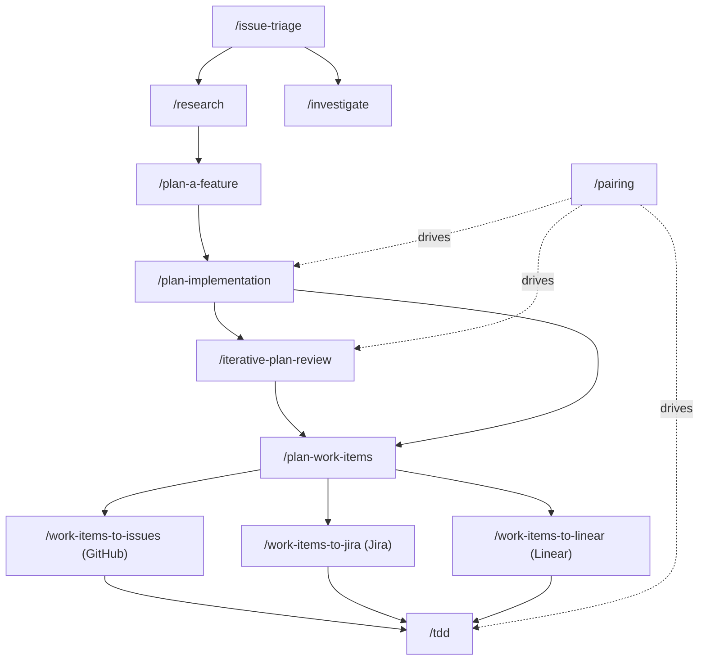
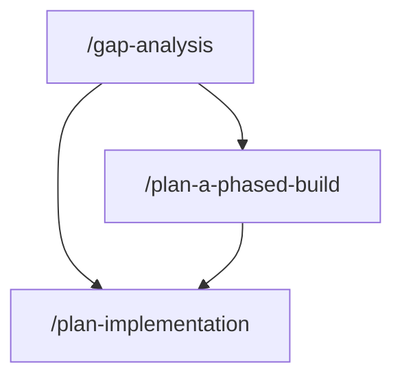
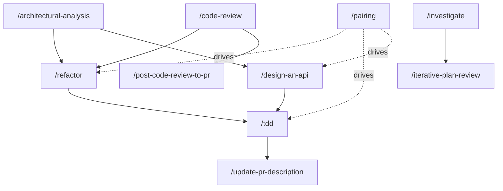
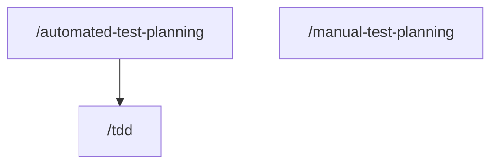
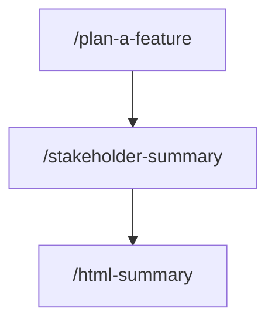

# Workflows

הדף הזה הוא המפה של אילו סקילים של Han משתרשרים זה לזה. רוב העבודה האמיתית מריצה כמה סקילים ברצף, כשהפלט של אחד הופך לקלט של הבא. הדף מציג את השרשראות הנפוצות, עם דיאגרמת זרימה בכל מקום שבו שרשרת מסתעפת מספיק כדי שתמונה תנצח את הטקסט.

זהו אחד מארבעה משטחי ניווט, ולכל אחד תפקיד נפרד:

- **הדף הזה (Workflows)** הוא המפה של אילו סקילים משתרשרים זה לזה.
- **[Quickstart](./quickstart.md)** נותן לך מסלולי "עשה-את-זה-עכשיו" לחמישה מצבים נפוצים.
- **[מדריכי How-to](./how-to/README.md)** מוליכים משימה אחת מקצה לקצה, צעד אחר צעד.
- **[מושגי יסוד](./concepts.md)** מסביר את מודל הסקילים והסוכנים שכל החבילה בנויה עליו.

אם אתה יודע מה המשימה אבל לא את הרצף, הגעת למקום הנכון. אם אתה רוצה את המודל שמאחורי הסקילים, קרא קודם את מושגי היסוד.

## מבעיה לשינוי שנשלח

סקילי התכנון מזינים את סקילי הקוד והמסירה. זו השרשרת הארוכה ביותר בחבילה, והיא מסתעפת בכמה נקודות לפי מה שאתה כבר יודע ואיפה העבודה מנוהלת.

- **[`/issue-triage`](../han-research/docs/skills/issue-triage.md) → [`/investigate`](../han-coding/docs/skills/investigate.md).** כשדיווח מעורפל, מיין אותו קודם, ואז חקור את שורש הבעיה.
- **[`/issue-triage`](../han-research/docs/skills/issue-triage.md) → [`/research`](../han-research/docs/skills/research.md) → [`/plan-a-feature`](../han-planning/docs/skills/plan-a-feature.md).** כשהמיון מוצא נעלם במרחב הבעיה, חקור קודם את האפשרויות, ואז הגדר את זו שנבחרה.
- **[`/plan-a-feature`](../han-planning/docs/skills/plan-a-feature.md) → [`/plan-implementation`](../han-planning/docs/skills/plan-implementation.md) → [`/iterative-plan-review`](../han-planning/docs/skills/iterative-plan-review.md) → [`/plan-work-items`](../han-planning/docs/skills/plan-work-items.md).** הגדר, תכנן את הבנייה, בחן את התוכנית בלחץ, ואז פרק אותה לעבודה. דלג על מעבר הסקירה כשהתוכנית כבר מהימנה.
- **[`/plan-work-items`](../han-planning/docs/skills/plan-work-items.md) ← פרסום.** הפוך את פריטי העבודה לכרטיסים במקום שבו הצוות שלך עוקב אחריהם: [`/work-items-to-issues`](../han-github/docs/skills/work-items-to-issues.md) ל-GitHub, [`/work-items-to-jira`](../han-atlassian/docs/skills/work-items-to-jira.md) ל-Jira (האופציונלי `han-atlassian`), או [`/work-items-to-linear`](../han-linear/docs/skills/work-items-to-linear.md) ל-Linear (האופציונלי `han-linear`).
- **[`/pairing`](../han-core/docs/skills/pairing.md) מניע את [`/plan-implementation`](../han-planning/docs/skills/plan-implementation.md) ואת [`/iterative-plan-review`](../han-planning/docs/skills/iterative-plan-review.md).** שניהם מריצים היום את הסבבים שלהם בלי לעצור, ולכן כאן העטיפה משנה הכי הרבה: אתה רואה כל סבב כשהוא נסגר, במקום רק את התוכנית הגמורה.

## מפער לתוכנית

כשיש לך שני תוצרים להשוות (מפרט מול מימוש, PRD מול פיצ'ר ששוחרר), התחל מדוח הפערים ונתב את הממצאים שלו לתכנון.

- **[`/gap-analysis`](../han-research/docs/skills/gap-analysis.md) → [`/plan-implementation`](../han-planning/docs/skills/plan-implementation.md).** מזהי ה-`G-NNN` של דוח הפערים הופכים לעבודה בתוכנית המימוש.
- **[`/gap-analysis`](../han-research/docs/skills/gap-analysis.md) → [`/plan-a-phased-build`](../han-planning/docs/skills/plan-a-phased-build.md) → [`/plan-implementation`](../han-planning/docs/skills/plan-implementation.md).** סדר קודם את מזהי ה-`G-NNN` לפרוסות אנכיות, ואז תן לכל שלב שאושר תוכנית מימוש משלו.

## עבודה בקוד

סקילי הסקירה, הריפקטורינג והבנייה משתרשרים בשני הכיוונים: סקירה יכולה להזין ריפקטורינג, וריפקטורינג יכול להכשיר את הקרקע לבנייה test-first.

- **[`/code-review`](../han-coding/docs/skills/code-review.md) → [`/post-code-review-to-pr`](../han-github/docs/skills/post-code-review-to-pr.md).** סקור מקומית, ואז פרסם את הסקירה ל-PR.
- **[`/code-review`](../han-coding/docs/skills/code-review.md) או [`/architectural-analysis`](../han-coding/docs/skills/architectural-analysis.md) → [`/refactor`](../han-coding/docs/skills/refactor.md).** הממצאים המבניים של הסקירה הופכים להוראות העבודה של תוכנית הריפקטורינג.
- **[`/refactor`](../han-coding/docs/skills/refactor.md) → [`/tdd`](../han-coding/docs/skills/tdd.md).** ריפקטורינג מכין הופך את השינוי לקל, ואז `/tdd` מבצע את השינוי הקל.
- **[`/architectural-analysis`](../han-coding/docs/skills/architectural-analysis.md) → [`/design-an-api`](../han-coding/docs/skills/design-an-api.md) → [`/tdd`](../han-coding/docs/skills/tdd.md).** שפוט את המבנה שאתה מעצב לתוכו, עצב את החוזה מול מטרה מוצהרת אחת, ואז ממש אותו test-first. שלב הניתוח אופציונלי; `/design-an-api` מריץ גל גילוי משלו כשאתה מתחיל שם.
- **[`/investigate`](../han-coding/docs/skills/investigate.md) → [`/iterative-plan-review`](../han-planning/docs/skills/iterative-plan-review.md).** אתר את שורש הבאג, ואז בחן בלחץ את התיקון המוצע.
- **[`/tdd`](../han-coding/docs/skills/tdd.md) → [`/update-pr-description`](../han-github/docs/skills/update-pr-description.md).** ברגע שהענף נושא את השינוי, הפוך את הקומיטים שלו לגוף ה-PR. זה חצי התיאור של ה-PR; `/post-code-review-to-pr` הוא חצי הסקירה, והשניים בלתי תלויים.
- **[`/pairing`](../han-core/docs/skills/pairing.md) מניע את [`/refactor`](../han-coding/docs/skills/refactor.md), את [`/tdd`](../han-coding/docs/skills/tdd.md) ואת [`/design-an-api`](../han-coding/docs/skills/design-an-api.md).** זו לא שרשרת אלא עטיפה: `/pairing` מריץ אחד מהם ולוקח את השליטה בחזרה בכל גבול יחידה, כך שאתה סוקר תוך כדי שהעבודה נוחתת ולא בסוף. הפעלה ישירה של כל אחד מהשלושה מריצה אותו ברצף אחד, ללא שינוי.

## תכנון הבדיקות

שני סקילים מתכננים בדיקות, וההבדל ביניהם הוא מי מריץ אותן. שניהם מקבלים את אותם סוגי קלט (ענף, פיצ'ר, תוכנית, PR), אז בחר לפי הקהל ולא לפי השלב.

- **[`/automated-test-planning`](../han-coding/docs/skills/automated-test-planning.md) → [`/tdd`](../han-coding/docs/skills/tdd.md).** מצא קודם את פערי הכיסוי ואת מקרי הקצה, ואז ממש את הבדיקות test-first. התוכנית נוקבת במה לכתוב; `/tdd` כותב את זה.
- **[`/manual-test-planning`](../han-coding/docs/skills/manual-test-planning.md).** האח לשלבים שאדם מריץ ידנית, כמעבר קבלה או כמעבר QA. הוא מסתיים במסמך, כי שום דבר במורד הזרם לא הופך אותו לאוטומטי.

## הבנה ותיעוד של בסיס קוד

השרשראות האלה ליניאריות, ולכן הן לא צריכות דיאגרמה.

- **[`/project-discovery`](../han-core/docs/skills/project-discovery.md) → [`/project-documentation`](../han-documentation/docs/skills/project-documentation.md) → [`/coding-standard`](../han-coding/docs/skills/coding-standard.md).** גלה את הפרויקט, תעד אותו, ואז לכוד את המוסכמות שלו כתקנים.
- **[`/code-overview`](../han-coding/docs/skills/code-overview.md) → [`/code-review`](../han-coding/docs/skills/code-review.md).** התמצא קודם בקוד לא מוכר או ב-PR, ואז שפוט אם הוא טוב.
- **[`/code-walkthrough`](../han-coding/docs/skills/code-walkthrough.md) → [`/code-review`](../han-coding/docs/skills/code-review.md).** אותה שרשרת כשאתה רוצה שילמדו אותך במקום שיגישו לך מסמך: עבור על השינוי צעד אחר צעד, שאל שאלות תוך כדי, ואז סקור אותו. פנה ל-`/code-overview` במקום זאת כשאתה רוצה תוצר אחד שאפשר לשמור, לשתף או להדביק לתוך תיאור PR.
- **[`/project-documentation`](../han-documentation/docs/skills/project-documentation.md) ← המסמכים המתמחים.** מסמכי פיצ'רים ומערכות חיים ב-`/project-documentation`, אבל שלושה סוגי כתיבה מנותבים למקום אחר: החלטה והחלופות שנדחו הולכות ל-[`/architectural-decision-record`](../han-documentation/docs/skills/architectural-decision-record.md), תרחיש תפעולי שמישהו מקבל עליו קריאה הולך ל-[`/runbook`](../han-documentation/docs/skills/runbook.md), ומוסכמה שאפשר לאכוף הולכת ל-[`/coding-standard`](../han-coding/docs/skills/coding-standard.md).

## שיתוף העבודה עם קורא לא-טכני

מפרט נכתב עבור האנשים שיבנו את הדבר. שני הסקילים האלה הופכים אותו למשהו עבור האנשים שמממנים או מאשרים אותו.

- **[`/plan-a-feature`](../han-planning/docs/skills/plan-a-feature.md) → [`/stakeholder-summary`](../han-reporting/docs/skills/stakeholder-summary.md) → [`/html-summary`](../han-reporting/docs/skills/html-summary.md).** הגדר את הפיצ'ר, נסח אותו מחדש בשפה פשוטה לבעלי עניין, ואז רנדר את הסיכום הזה כקובץ HTML אחד עצמאי שאפשר לשלוח למישהו.
- **[`/edit-for-readability`](../han-communication/docs/skills/edit-for-readability.md).** מעבר הליטוש לכל אחד מאלה. הפנה אותו למסמך שכל סקיל אחר ייצר, או לטיוטה בשיחה, והוא ישכתב את הטקסט מול תקן הקריאוּת המשותף בלי לשנות עובדה.

## תיעוד קשור

- [שורש הריפו](../README.md). דף הנחיתה של חבילת Han.
- [אינדקס הסקילים](./skills/README.md). כל סקיל, עם שורת ריח וקישור לתיעוד המורחב שלו.
- [אינדקס הסוכנים](./agents/README.md). כל סוכן שהסקילים משגרים.
- [אינדקס הפלאגינים](./choosing-a-han-plugin.md). כל פלאגין ואיזה מהם להתקין.
- [Quickstart](./quickstart.md), [מדריכי How-to](./how-to/README.md), [מושגי יסוד](./concepts.md). שלושת משטחי הניווט האחרים.
